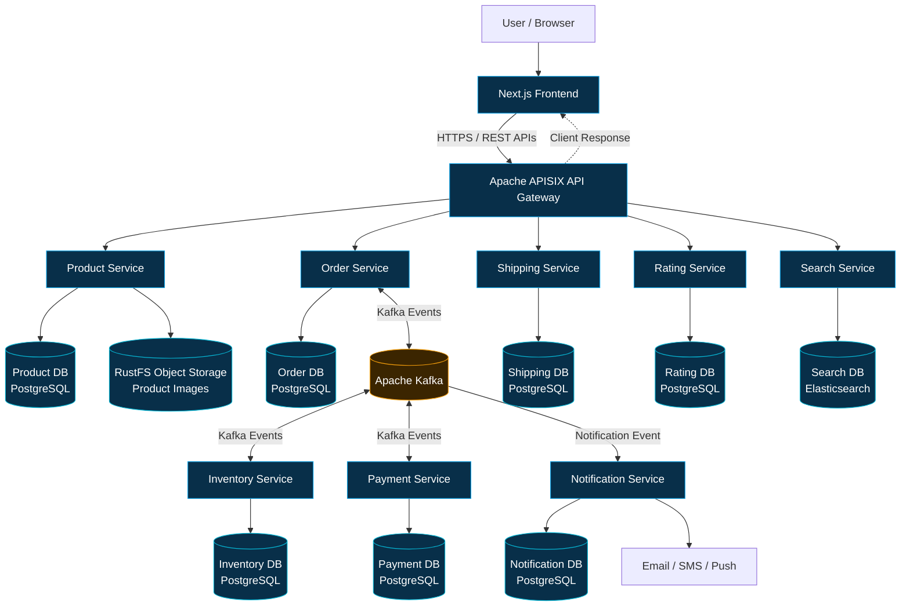

# E-Commerce Microservices Platform

A distributed e-commerce application built with **Java 21, Spring Boot, Next.js, Apache APISIX, Apache Kafka, and PostgreSQL**. The system uses eight backend microservices, with Kafka coordinating asynchronous order, inventory, payment, and notification workflows.

## Architecture



### Architecture Overview

- **Frontend:** Next.js provides the user interface.
- **API Gateway:** Apache APISIX routes REST requests to backend services.
- **Microservices:** Eight independent services handle different e-commerce responsibilities.
- **Messaging:** Apache Kafka enables asynchronous communication between Order, Inventory, Payment, and Notification services.
- **Databases:** PostgreSQL stores service data, while Elasticsearch supports product search.
- **Object Storage:** RustFS stores product images and other supported files.

## Microservices

| Service | Responsibility |
|---|---|
| `product-service` | Manages products and categories |
| `order-service` | Creates orders and coordinates order processing |
| `inventory-service` | Manages stock and inventory reservations |
| `payment-service` | Processes payments and tracks payment status |
| `shipping-service` | Manages shipments |
| `rating-service` | Manages product ratings and reviews |
| `search-service` | Provides product search using Elasticsearch |
| `notification-service` | Sends notifications through supported channels |

## Technology Stack

- **Backend:** Java 21, Spring Boot, Spring Security, Spring Data JPA
- **Frontend:** Next.js, React
- **API Gateway:** Apache APISIX
- **Messaging:** Apache Kafka
- **Database:** PostgreSQL
- **Object Storage:** RustFS
- **Containerization:** Docker, Docker Compose
- **Monitoring:** Spring Boot Actuator, Micrometer
- **Resilience:** Resilience4j
- **Build Tool:** Maven

## Service Communication

### Synchronous Communication

The frontend sends REST requests through Apache APISIX. The gateway routes each request to the appropriate backend service and returns the response.

### Asynchronous Communication with Kafka

Order, Inventory, and Payment communicate through Kafka events during the order-processing workflow.

1. **Order Created:** Order Service publishes an event containing order details.
2. **Reserve Inventory:** Inventory Service consumes the relevant event and processes the stock reservation.
3. **Inventory Result:** Inventory Service publishes the reservation result.
4. **Process Payment:** Order Service initiates payment processing through a Kafka event.
5. **Payment Result:** Payment Service publishes the payment success or failure result.
6. **Order Update:** Order Service processes the result and updates the order status.
7. **Send Notification:** Kafka delivers a notification event to Notification Service.
8. **Notification Sent:** Notification Service processes the notification and publishes the result event.

This event-driven approach reduces direct dependencies between services. Exact event names, retry handling, and compensation logic depend on the implementation.

## Data Storage

The architecture follows a service-owned data model:

- **Product Service:** PostgreSQL and RustFS for product data and images.
- **Order Service:** PostgreSQL for order data.
- **Inventory Service:** PostgreSQL for stock information.
- **Payment Service:** PostgreSQL for payment records.
- **Shipping Service:** PostgreSQL for shipment data.
- **Rating Service:** PostgreSQL for ratings and reviews.
- **Search Service:** Elasticsearch for product search.
- **Notification Service:** PostgreSQL for notification-related data.

Services should access their own data and exchange information through APIs or events instead of directly querying another service's database.

## Running Locally

### Prerequisites

- Docker Desktop on macOS or Windows, or Docker Engine on Linux
- Git

### Start the Application

```bash
git clone https://github.com/Abhip2003/ecommerce-microservices.git
cd ecommerce-microservices
docker compose up --build
```

Use the repository's Docker Compose configuration as the source of truth for service names, ports, environment variables, and dependencies.

### Stop the Application

```bash
docker compose down
```

Avoid removing named volumes unless you intentionally want to delete persisted database data.

## Monitoring and Reliability

- **Spring Boot Actuator:** Exposes application health endpoints.
- **Micrometer and Prometheus:** Support metrics collection.
- **Correlation IDs:** Help trace requests across services.
- **Resilience4j:** Provides resilience patterns for supported service calls.

## Key Features

- Eight independent Spring Boot microservices
- Apache APISIX API Gateway
- Kafka-based asynchronous communication
- Event-driven order, inventory, and payment workflow
- Service-owned PostgreSQL databases
- RustFS object storage
- Docker Compose local environment
- Health checks, metrics, and resilience support

## Architecture Trade-offs

### Benefits

- Clear separation of business responsibilities.
- Reduced direct coupling through Kafka events.
- Independent service maintenance and potential scaling.
- Separate data ownership for each service.

### Challenges

- Distributed workflows require careful failure and retry handling.
- Duplicate events and eventual consistency need consideration.
- Multiple services increase debugging and operational complexity.

Docker Compose is used for local development. Kubernetes is not required for this setup.

## License

This project is licensed under the MIT License.
